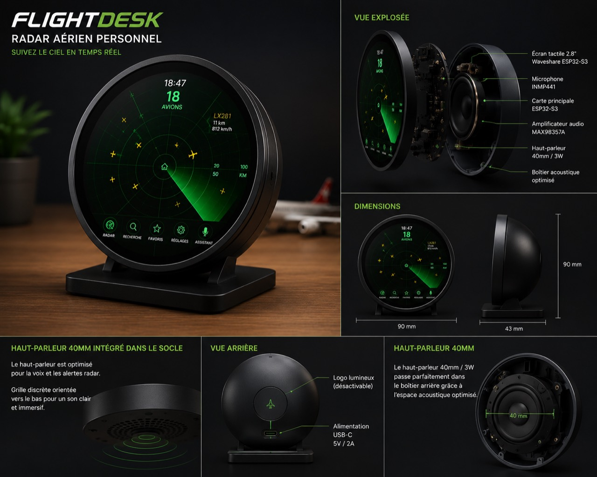

# FlightDesk



**FlightDesk** est un radar aérien personnel de bureau basé sur un écran tactile
rond **Waveshare ESP32-S3 Touch LCD 2.8C**. L'objectif : visualiser les avions
autour de chez soi en temps réel, sélectionner un vol au toucher, écouter des
annonces vocales et poser des questions à un assistant vocal Gemini intégré.

> État actuel : prototype live utilisable. Le simulateur web sert à itérer
> l'interface, et une cible autonome **Xiaozhi Ball V2** rend maintenant le
> radar directement sur l'ESP32-S3 sans dépendre de Home Assistant ni de la
> gateway FlightDesk.

## Expérience visée

- Radar vert animé inspiré d'un scope aérien compact.
- Suivi des avions proches via données ADS-B récupérées par Internet, avec
  rayon 20 / 50 / 100 / 250 km.
- Sélection tactile d'un avion pour afficher indicatif, compagnie, distance,
  altitude, vitesse et direction.
- Favoris pour mettre certains vols en avant.
- Assistant vocal Gemini pour interroger les avions visibles.
- Annonces vocales via micro I2S INMP441, ampli MAX98357A et haut-parleur.
- Réglages embarqués : code postal, position maison, rayon, intensité radar,
  mode nuit, volume, muet, langue, Wi-Fi et OTA.

## Matériel prévu

- Xiaozhi Ball V2 pour la preview ronde ESPHome actuelle.
- Waveshare ESP32-S3 Touch LCD 2.8C, SKU 29086, 480 × 480.
- Microphone I2S INMP441.
- Amplificateur audio I2S MAX98357A.
- Haut-parleur 40 mm, 4 Ω / 3 W.
- Fournisseur de données trafic via Internet.
- Boîtier imprimé en 3D.
- Alimentation USB-C 5 V / 2 A.

## Firmware Autonome Xiaozhi Ball V2

Le firmware autonome est dans
[`firmware/standalone-xiaozhi-v2`](firmware/standalone-xiaozhi-v2).

Il se connecte directement au Wi-Fi, récupère le trafic Internet via
Airplanes.live, dessine le radar localement sur le GC9A01A, gère le tactile
CST816 et peut appeler Gemini directement quand une clé est configurée dans
`include/secrets.h`.

La carte embarquée est pour l'instant un filigrane local stylisé. Les tuiles
OpenStreetMap et les photos avion restent dans le simulateur web, car leur
cache/décodage doit être traité proprement sur ESP32 avant d'être fiable.

## Firmware Waveshare ESP32-S3 Touch LCD 2.8C

Le port pour l'écran final reçu est isolé dans
[`firmware/standalone-waveshare-2.8c`](firmware/standalone-waveshare-2.8c).

La première cible est un bring-up matériel : USB série, Wi-Fi, profil
Flash/PSRAM et scan I2C sur les broches Waveshare documentées. L'écran 480 ×
480 et le tactile seront portés depuis le demo officiel Waveshare avant d'y
remettre le radar FlightDesk complet.

## Preview ESPHome Xiaozhi Ball V2

L'ancienne preview matérielle ESPHome est documentée ici :
[docs/XIAOZHI_BALL_V2.md](docs/XIAOZHI_BALL_V2.md).

Elle utilise une config ESPHome publique et nettoyée :
[`firmware/esphome/xiaozhi-ball-v2`](firmware/esphome/xiaozhi-ball-v2).

Le principe historique est volontairement simple :

- le serveur FlightDesk rend `/api/esp32/radar.png` en 240 × 240 ;
- la Ball télécharge l'image toutes les 30 s ;
- la Ball dessine localement le balayage toutes les 100 ms ;
- les touches sont envoyées à `/api/esp32/action`.

## Démarrage firmware PlatformIO

1. Installer VS Code et PlatformIO.
2. Ouvrir le dossier `firmware`.
3. Copier `include/secrets.example.h` vers `include/secrets.h`.
4. Renseigner les secrets localement, sans les publier.
5. Compiler l'environnement `flightdesk`.
6. Avant le premier flash réel, reporter dans `include/board_pins.h` les broches
   de l'exemple officiel Waveshare correspondant exactement à la révision reçue.

## Preview simulateur web

Un simulateur web permet de travailler l'interface avant réception du matériel :

```bash
cd simulator
python3 server.py
```

Puis ouvrir `http://127.0.0.1:4173/live`.

Le simulateur couvre déjà le radar animé, une vraie carte OpenStreetMap en
filigrane vert, le trafic live via Airplanes.live avec fallback OpenSky, la
sélection d'un vol, les favoris, le code postal, les réglages principaux et une
réponse IA contextuelle sur le trafic.

Si OpenSky est indisponible ou limité, la preview repasse automatiquement sur
des vols de démonstration animés.

La preview locale proxifie les données trafic, les tuiles OpenStreetMap et les
images avion via le serveur `simulator/server.py`, afin d'éviter les blocages
CORS ou les restrictions du navigateur mobile.

Pour activer Gemini côté serveur, définir une clé avant de lancer le simulateur :

```bash
cp simulator/.env.example simulator/.env
# renseigner GEMINI_API_KEY dans simulator/.env
python3 simulator/server.py
```

Sans clé, FlightDesk garde un mode IA local qui résume les vols visibles sans
appel externe.

## Faire connaître le projet

Un kit de publication est disponible dans
[docs/social/PROMOTION.md](docs/social/PROMOTION.md) avec une description GitHub,
des topics et des textes courts pour réseaux sociaux/forums.

## Structure

```text
FlightDesk/
├── docs/
│   ├── assets/
│   ├── ARCHITECTURE.md
│   └── ROADMAP.md
├── enclosure/
├── firmware/
│   ├── esphome/
│   ├── include/
│   ├── src/
│   └── platformio.ini
├── hardware/
├── simulator/
├── LICENSE
└── README.md
```

## Roadmap courte

- `v0.1` : architecture PlatformIO, modèle avion, radar simulé, réglages.
- `v0.2` : simulateur web, intégration écran Waveshare, LVGL et tactile.
- `v0.3` : Wi-Fi, position maison, fournisseur Internet et cache réseau.
- `v0.4` : pipeline audio INMP441 / MAX98357A.
- `v0.5` : Gemini, transcription, réponses vocales et contexte avions.
- `v1.0` : OTA, boîtier imprimé, guide de montage et release publique.

La roadmap détaillée est dans [docs/ROADMAP.md](docs/ROADMAP.md).

## Sécurité des clés

Ne jamais publier une clé Gemini, Wi-Fi ou fournisseur trafic dans GitHub.
`firmware/include/secrets.h` est ignoré par Git. Seul
`firmware/include/secrets.example.h` doit rester versionné.

## Licence

MIT
